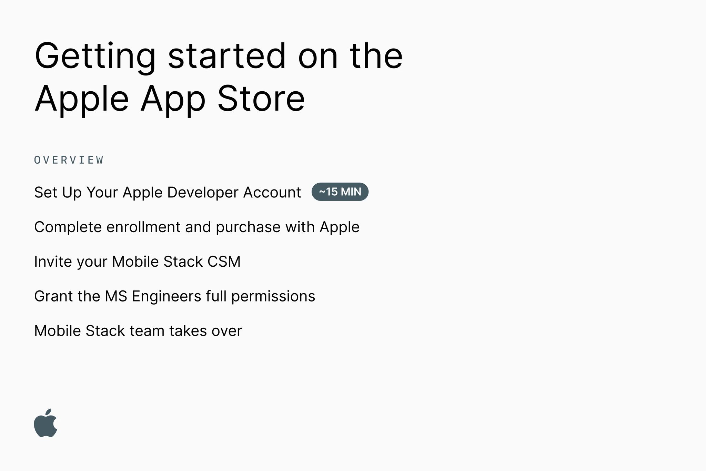

# Getting started on the Apple App Store

This is a step-by-step guide for creating your Apple App Store account and enrolling in the Developer Program for your Apple iOS app(s).

→ Have questions? We’re here to help! Please ping your Mobile Stack Customer Success Manager (MS CSM) on Slack for help. Your MS CSM is happy to answer questions or go through the steps on a call. You'll invite them to your account once it's created so they can guide you through the rest of the process.

## WHO on your team should start the process?

An officer at your organization (or anyone with legal signing authority) should go through the initial setup, as they will need to complete KYC using a Government-issued ID. Once the account is set up, other members of your team will be able to contribute or take the lead.

## WHAT you'll need

An Apple device (iPhone or iPad with Touch ID, Face ID, or passcode enabled, or a Mac with the [T2 Security Chip](https://support.apple.com/HT208862) and [Apple Silicon](https://support.apple.com/HT211814)). You must use the same device for the entire enrollment process.

- **An Apple ID** with [two-factor authentication](https://developer.apple.com/support/authentication/) turned on. Your Apple ID information must be valid and up to date — including, but not limited to, your first name (given name), last name (family name), address, phone number, trusted phone number, and trusted devices
- The latest version of the Apple Developer app installed on your device
- To sign in to iCloud on your device
- **Organization information**: Entity type (LLC, Sole Proprietorship, Incorporated, etc.), Legal entity name, A [D‑U‑N‑S® Number](https://support.google.com/googleplay/android-developer/answer/13628312?hl=en) for your organization
- **Headquarters address & phone number**, which will be published online
- **Signing authority confirmation**
- **Documents**: These may include business registration documents and tax identification documents, proof of address

## WHEN: Timeline

**Please start this process as soon as the MS team starts working on your app. The goal is to avoid delays in publishing and getting your MS app live once it's built.**

D‑U‑N‑S® Number can take 30 business days; please start this process immediately.

- In the U.S.? [Get your D-U-N-S® Number here](https://www.dnb.com/duns/get-a-duns.html)

- Outside of the U.S.? Please [contact your local Duns & Bradstreet office](https://www.dnb.com/utility-pages/global-customer-service-centers.html)

Apple App Store business verification may take a few days to a few weeks.

## Step 1: Set Up Your Apple Developer Account (~15 min):

Launch the Apple Developer app on the device you want to use for enrollment. Please use the same device throughout this process.

- Tap or click the “Account” tab
- Sign in with your Apple ID, which must have 2FA enabled, and follow the prompts

Need an account? Create one [here](https://appleid.apple.com/account) and [turn on 2FA](https://support.apple.com/en-gb/HT204915)

- [Enroll to Apple Developer Program](https://developer.apple.com/programs/enroll/) as an organization.

**You must enroll as an Organization and not an Individual. This can not be easily changed later and can stop your app from being published.**

Review the Apple Developer information then tap or click “Start your Enrollment.”

**When selecting your 'Entity type' choose Company / Organisation**

Continue through the prompts to complete the enrollment process.

After you submit your information, Apple will review it. You will then receive an email with the next steps. **Please watch your email closely.**

### Step 1.1: Complete enrollment and purchase

Once your enrollment information has been verified and approved, you’ll receive an email letting you know that you can complete your enrollment.

- Launch the Apple Developer app on the device you used for enrollment
- Tap or click the “Account” tab
- Sign in with the Apple ID you used for enrollment
- Tap or click “Continue Your Enrollment”
- Follow the prompts. The process completes when you tap or click the “Subscribe” button

After the purchase, you must wait on Apple for up to 48 hours. **Please watch your email closely for the next steps.**

### Step 1.2: Invite your MS CSM

[Log in to App Store Connect](https://appstoreconnect.apple.com/apps)

- Click “Users & Access”
- [Invite Valora](https://developer.apple.com/help/account/manage-your-team/invite-team-members/): Invite your MS CSM as an **Admin**

**After your MS CSM invites MS engineers, we will ask you to take an additional step to grant the MS Engineers full permissions needed to publish your app.**

## Step 2: The Mobile Stack team takes over

Your CSM will invite key engineers to the project(s). Our team will set up the app, testing, and production tracks. We will also set up your store and developer listing.

During this process, you will need to provide copy and assets, as detailed in
[Mobile Stack: App Store & Google Play Asset Requirements](https://docs.mobilestack.xyz/publishing/asset-requirements), to be used to create your store listing.

To get started, the Mobile Stack team will require certain assets. Please complete our [intake form as soon as possible](https://forms.gle/BBG8WSCPSyEN6pS59).
