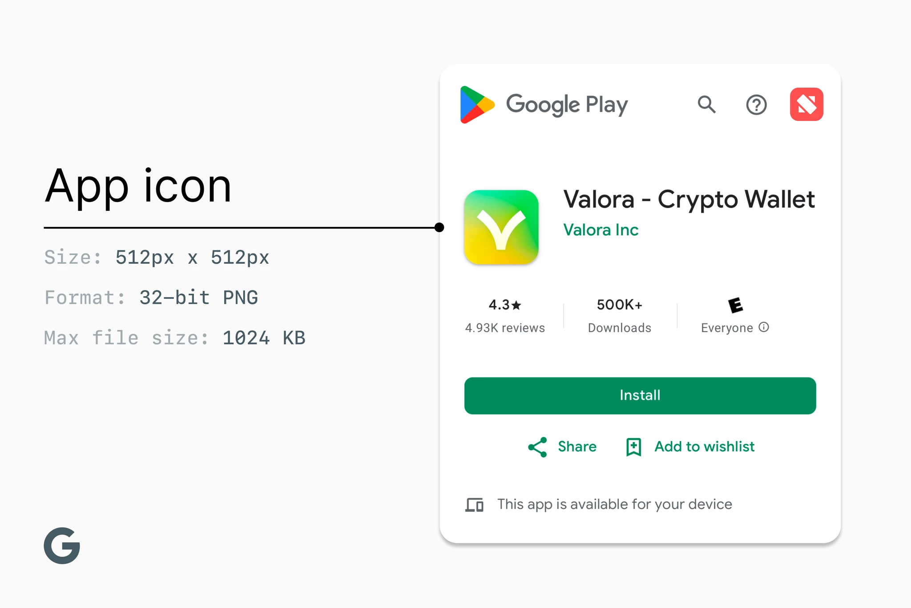
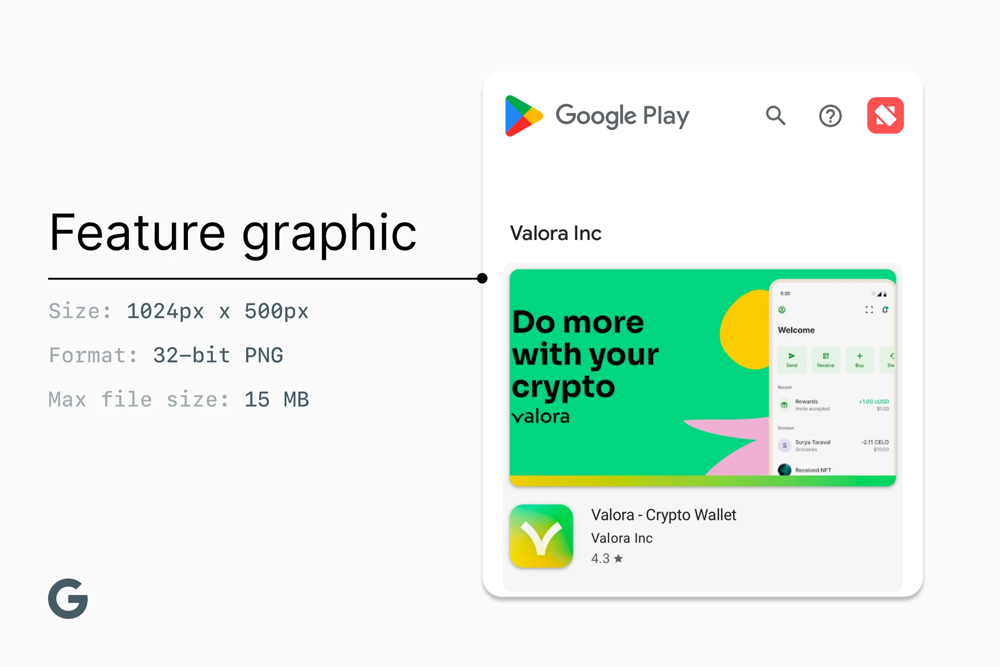
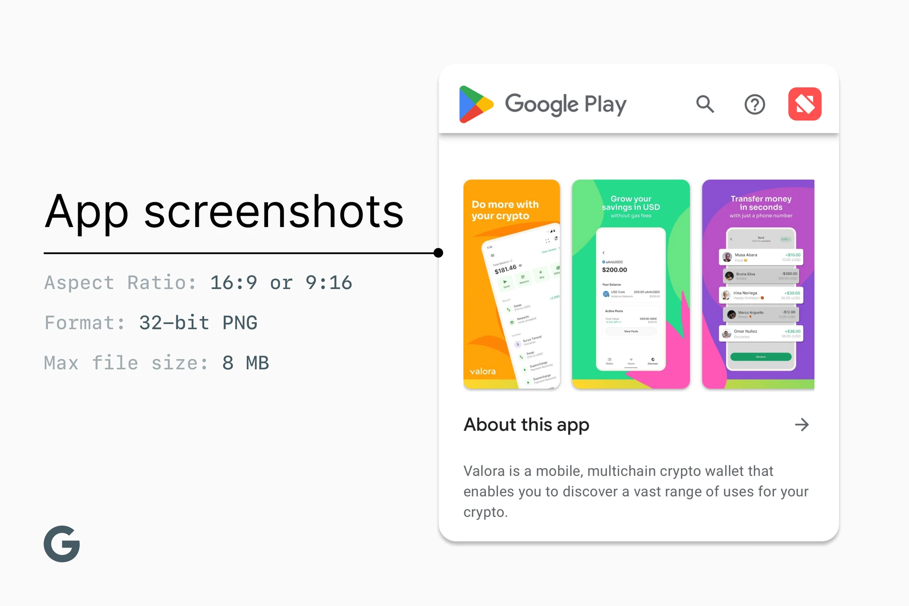
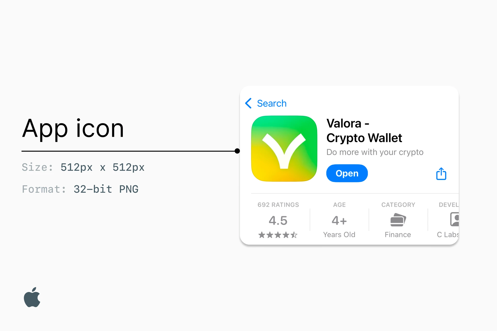
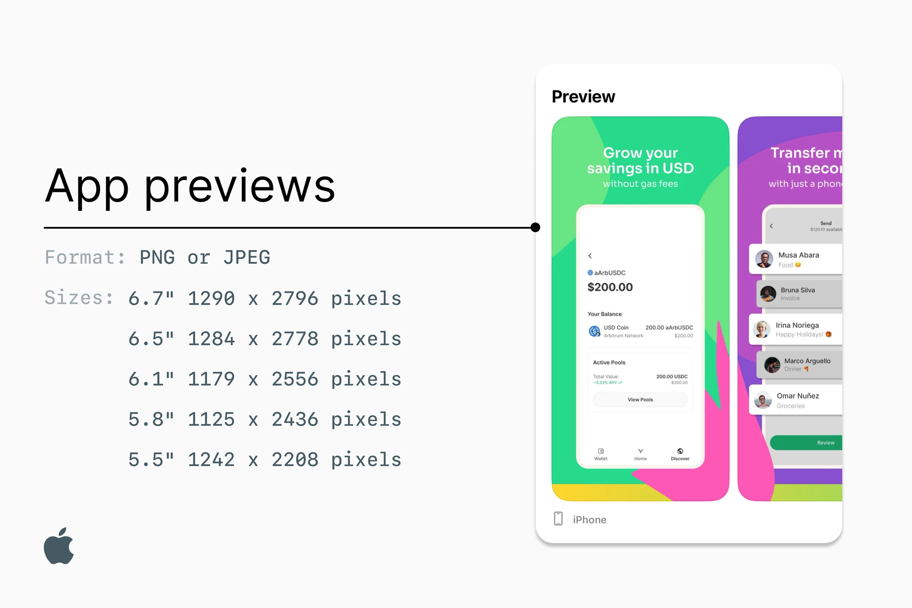

# App Store & Google Play Asset Requirements

This document outlines what assets are needed for each of the app stores.

## Google Play Asset Requirements

### Images

All images should be PNG or JPEG.

### App Icon

- 512x512 pixels
- Max 1 MB
- Must meet these [design specs](https://developer.android.com/distribute/google-play/resources/icon-design-specifications) and [metadata policy](https://support.google.com/googleplay/android-developer/answer/9898842)

### Feature graphic

- 1024 by 500 pixels
- Max 15 MB

### 2-8 phone screenshots.

- 16:9 or 9:16 aspect ratio
- Each side between 320 px and 3840 px
- Max 8 MB each
- Video (optional)
- 10” tablet: (16:9 or 9:16 aspect ratio
- Each side between 320 px and 3840 px. max 8 MB each)

### Copy

- App name (30 characters)
- Short description (80 characters
- Full description (4000 characters)
- Link to Terms & Conditions
- Link to Privacy Policy
- Email address, e.g. support@valoraapp.xyz
- Website URL
- A public page describing how to delete an account from the app

## Apple App Store Asset Requirements

### Images

All images should be PNG or JPEG.

### App Icon

512x512 pixels

### 2-10 App Screenshots

- 6.7" 1290 x 2796 pixels
- 6.5" 1284 x 2778 pixels
- 6.1" 1179 x 2556 pixels
- 5.8" 1125 x 2436 pixels
- 5.5" 1242 x 2208 pixels
- Reference [this doc](https://developer.apple.com/help/app-store-connect/reference/screenshot-specifications/) from App Store Connect

App Video Previews (up to 3; 30-second videos - optional)

#### Graphic requirements:

- any phone frames used must be from an iPhone
- phone basic UI like battery icon, time bar, etc. must be iOS
- screenshots need to contain actual product screens - promotional copy is optional

### Copy

- App name (30 characters)
- Subtitle (30 characters)
- Full description (no character limit)
- Promotional text (70 characters - optional)
- Keywords (100 characters)
- Privacy & data collection information in compliance with Apple guidelines
- What’s New / Release Notes
- Test information - provide necessary information (e.g. a testing phone number, a recovery phrase to a testing wallet, etc.) for Apple reviewers
- Link to Terms & Conditions
- Link to Privacy Policy
- Email address, e.g. support@valoraapp.xyz
- Website URL
