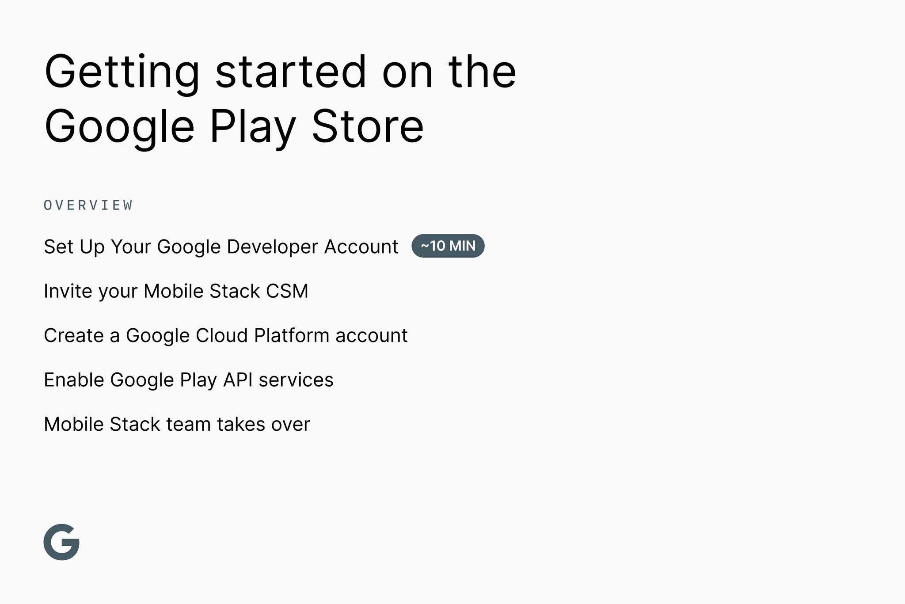

# Getting started on the Google Play Store

This is a step-by-step guide for creating your Google Play account and enrolling in the Developer Program for your Android app(s).

**→ Have questions?** We’re here to help! Please ping your Mobile Stack Customer Success Manager (MS CSM) on Slack for help. Your MS CSM is happy to answer questions or go through the steps on a call. You'll invite them to your account once it's created so they can guide you through the rest of the process.

## WHO on your team should start the process?

An officer at your organization (or anyone with legal signing authority) should go through the initial setup, as they will need to complete KYC using a Government-issued ID. Once the account is set up, other members of your team will be able to contribute or take the lead.

## WHAT you'll need

A traditional Google account using your business email account. Make sure you have created an account at https://accounts.google.com/SignUp

- **[A D‑U‑N‑S® Number](https://support.google.com/googleplay/android-developer/answer/13628312?hl=en)** for your organization
- **Headquarters address & phone number**, which will be published online.
- **A phone number & email address** for your individual developer profile
- **A contact phone number and email address** for your organization's Google account

## WHEN: Timeline

**Please start this process as soon as the MS team starts working on your app. The goal is to avoid delays in publishing and getting your MS app live once it's built.**

D‑U‑N‑S® Number can take 30 business days; please start this process immediately.

- In the U.S.? [Get your D-U-N-S® Number here](https://www.dnb.com/duns/get-a-duns.html).

- Outside of the U.S.? Please [contact your local Duns & Bradstreet office](https://www.dnb.com/utility-pages/global-customer-service-centers.html)

## Step 1: Set Up Your Google Developer Account (~10 min)

Visit https://play.google.com/apps/publish/signup/ and log in with your Google Login.

- Under organization type, choose “a company or business”
- Continue filling in the prompts
- Continue until finalizing the $25 payment

**You should receive a confirmation email that your verification is in process (24-48 hrs).**

## Step 2: Once verification is complete (~15 min)

**Invite your MS CSM:**

- Log into your Google Play Console: https://play.google.com/console
- Click on “Users and Permissions” to the left
- Click “Invite New Users”
- Invite your MS CSM as an Admin
- Ping your MS CSM on Slack to confirm completion

### [Verify your website](https://support.google.com/googleplay/android-developer/answer/13205715?sjid=14760582666064445422-NA) using Google Search Console

Additionally, visit the [Play console](https://play.google.com/console) for a notification about pending website verification. Click on that. The following screen has a button to send the verification request to the site owner

Have the site owner receive and approve the verification request

### Create a [Google Cloud Platform](https://console.cloud.google.com/freetrial/signup/tos)

#### Add members to the project:

- Go to the [API Console](https://console.developers.google.com/)

- Open the console’s left-side menu and select "IAM & Admin"

- From the project list (top left, to the right of their logo), choose the project to which you want to add a member

- Click Grant Access and provide an email address. Each user should be an editor

Your CSM will provide a list of users to invite for your project

#### Enable Google Play API services:

- Go [here](https://play.google.com/console/u/0/developers/5802422777801763452/app-list?pli=1)
- In the left column, under “Setup”, click “API access”
- Confirm any notes as appropriate
- Click “View” on Google Cloud Platform
- Click “View All Products”
- Under Management, Choose \* “API & Service”
- Enable API & Services
- Turn on Google Play Android Developer API if you have not already

## Step 3: The Mobile Stack team takes over

Your CSM will invite key engineers to the project(s). Our team will set up the app, testing, and production tracks. We will also set up your store and developer listing.

During this process, you will need to provide copy and assets, as detailed in Mobile Stack: App Store & Google Play Asset Requirements, to be used to create your store listing.

To get started, the Mobile Stack team will require certain assets. Please complete our [intake form as soon as possible](https://forms.gle/BBG8WSCPSyEN6pS59).
